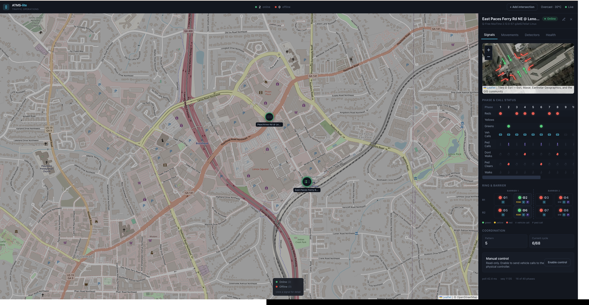

# ATMS-lite

A locally hosted Advanced Traffic Management System that talks NTCIP 1202 over
SNMP to a physical Q-Free MaxTime 2070 traffic controller, (with upcoming support for EOS, ASC/3, Siemens, and Swarco MCCain) and scales to many
intersections through either user creation on the mini map or lightweight simulated docker virtual controllers. ATMS-lite offers the ability to monitor a live controller status and provides 
a dashboard displaying singal phase status and the ability to hold/force off phases in the ring and barrier diagram. ATMS-lite also offers the ability to create a corridor and generate a real-time time space diagram for the configured corridor.

ATMS-lite was built and verified end to end against real hardware. (My test bench controller: A Intelight Model 2070 LC that connects to my laptop via ethernet)



## What it does

- **Live signal monitoring.** Polls phase status (red/yellow/green), ped
  states, and vehicle/ped calls at ~5 Hz over SNMP v1, streamed to the browser
  over WebSocket.
- **Interactive ring-and-barrier diagram.** Built from the controller's own
  ring and concurrency configuration. Click a phase to place a
  call.
- **Control path with safety interlocks.** Vehicle and ped calls are written to
  the controller only when an intersection is explicitly ON. Calls auto-clear
  on user request, disconnect, and shutdown. Every call is audited. 
- **Coordination monitor.** Pattern and a cycle length measured from the signal
  phase status. 
- **Detector and MOE stats.** Detector volume/occupancy plus per-phase green
  utilization computed from the signal stream.
- **Map and weather.** OpenStreetMap via Leaflet, pins colored by connection
  state, live weather from Open-Meteo (no API key).
- **Multi-intersection.** A gateway backend polls many controllers at once; each
  virtual intersection runs in its own container. One going offline degrades
  only its own tile.
- **Graceful hardware handling.** Connection state machine (connected → degraded
  → disconnected) with non-blocking background reconnect. Health is judged by
  SNMP responses, since the controller drops ICMP.

## Stack

- Backend: FastAPI, asyncio SNMP v1 poller (pysnmp), WebSocket stream
- Frontend: React 19 + Vite + Tailwind v4, Leaflet
- Emulator: hand-rolled SNMP v1 agent + dual-ring actuated signal engine, no
  third-party deps
- Deploy: Docker Compose (backend + frontend + N emulator containers)

## Run it

Point `backend/intersections.json` at your controller, (intersections.json) is where intersection locations are mapped, then set:

```
python -m venv .venv && .venv/bin/pip install -r backend/requirements.txt
.venv/bin/uvicorn app.main:app --app-dir backend --port 8000

npm install --prefix frontend
npm run dev --prefix frontend      # http://localhost:5173
```

Both are plain processes, not services, so they stop when the terminal or
machine closes and need restarting each session. `tools/start_backend.sh`
and `tools/start_frontend.sh` wrap the two commands above: each checks its
prerequisites (venv, node_modules), refuses to double-start if its port is
already taken, and waits for the service to actually respond before
returning. Use `--fg` on either to run in the foreground instead of
backgrounded.


`tools/start_stack.sh` starts both frontend and backend services and opens the dashboard in your
browser. Pass `--no-open` to skip opening the browser.

A virtual controller for testing without hardware:

```
EMU_SNMP_PORT=1161 .venv/bin/python emulator/main.py
```

The full containerized multi-intersection stack is in
[docs/docker.md](docs/docker.md). `tools/start_docker.sh` brings up the
compose stack (emulators, backend, frontend), waits for the backend to
respond, and opens the dashboard. Pass `--build` to rebuild images first,
`--no-open` to skip opening the browser, or `--extra` to bring up all 10
available virtual intersections instead of the default 4.

Registering one of those emulators as an intersection doesn't require typing
its host/port by hand: the "Add intersection" form's "Device API" dropdown
lists `docker-emulator-1..10` alongside the real device protocols - picking
one autofills host and port for you, since emulator container IPs aren't
stable across restarts and only the Compose service name (`emulator-N`).

## Layout

```
backend/    FastAPI poller, control path, REST + WebSocket
frontend/   React dashboard
emulator/   virtual NTCIP controller (SNMP agent + signal engine)
tools/      SNMP discovery CLI and bench utilities
docs/       network runbook, OID reference, milestone log, docker guide
```

## Docs

- [docs/network-setup.md](docs/network-setup.md) - how my test controller bench works 
- [docs/ntcip-oids.md](docs/ntcip-oids.md) - how the OIDs of the controller are read and written, decoded
  against the real unit!
- [docs/milestones.md](docs/milestones.md) - the gated build log, M0-M9, I broke this down in to milestones to help ease the build
- [docs/docker.md](docs/docker.md) - the containerized stack


